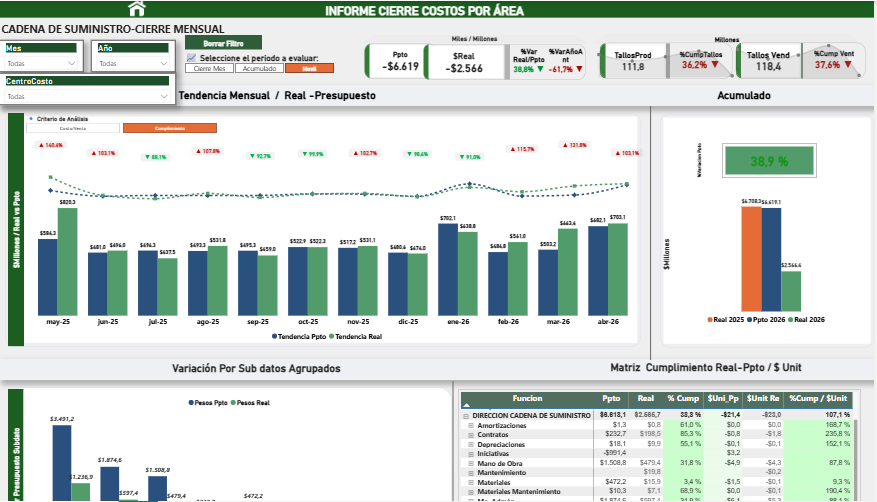

# 📊 Portafolio de Juan Marín — Analista de Datos

**Excel Avanzado | Power BI | DAX | SQL | Python | Automatización de Reportes**

---

## 🚀 Sobre mí

Analista de Datos con experiencia en automatización de reportes financieros y operativos. Reduje **más del 90%** el tiempo de generación de reportes mediante Power Query y Excel Avanzado. Especializado en diseño de dashboards ejecutivos, modelado de datos y procesos ETL.

📍 Bogotá, Colombia  
📧 estebanjuanmarin2006@gmail.com  
---

## 🛠️ Stack Técnico

| Área | Herramientas |
|------|-------------|
| Visualización | Power BI, Excel Avanzado |
| Modelado | DAX, Power Pivot, modelado estrella |
| ETL | Power Query, limpieza de datos |
| Bases de Datos | SQL Server, MySQL, PostgreSQL |
| Programación | Python (Pandas, NumPy) |

---

## 📁 Proyectos

### 1. Dashboard Ejecutivo de Cierre Financiero — Power BI

**Problema:** El cierre mensual de costos tardaba 8 horas en Excel manual, con errores y sin visión ejecutiva.  
**Solución:** Dashboard ejecutivo con análisis Real vs. Presupuesto mensual y acumulado, matriz de cumplimiento por función y KPIs de producción y ventas.  
**Herramientas:** Power BI · DAX · Power Query  
**Resultado:** Reducción del 90% en tiempo de generación de reportes.

---

### 2. Dashboard de Control Semanal de Producción — Excel

**Problema:** Falta de visibilidad rápida sobre avances, desviaciones e indicadores de producción.  
**Solución:** Dashboard interactivo en Excel para seguimiento semanal con identificación de desviaciones y monitoreo de KPIs clave.  
**Herramientas:** Excel · Power Query · Tablas dinámicas  
**Resultado:** Visualización rápida de indicadores para toma de decisiones operativas.

---

### 3. Automatización ETL — Power Query

**Problema:** Preparación manual de datos para reportes, propensa a errores y demoras.  
**Solución:** Flujo automatizado de extracción, transformación y carga (ETL) que limpia, combina y prepara datos sin intervención manual.  
**Herramientas:** Excel · Power Query  
**Resultado:** Datos limpios y listos para análisis en tiempo real.

---

### 4. Modelado de Datos — Relación de Tablas

Diagrama de estructura del modelo de datos utilizado en los proyectos de cierre contable, incluyendo relaciones entre tablas de hechos y dimensiones.

**Herramientas:** Power BI · Modelado relacional

---

## 🎓 Formación

- **Técnico en Programación para Análisis de Datos** — SENA, 2025
- **PostgreSQL for Everybody Specialization** — University of Michigan, Coursera, 2026
- **Análisis de Datos** — MinTIC, 2026
- **Google Advanced Data Analytics** — En formación, 2026

---

## 📫 Contacto

- **Email:** estebanjuanmarin2006@gmail.com
